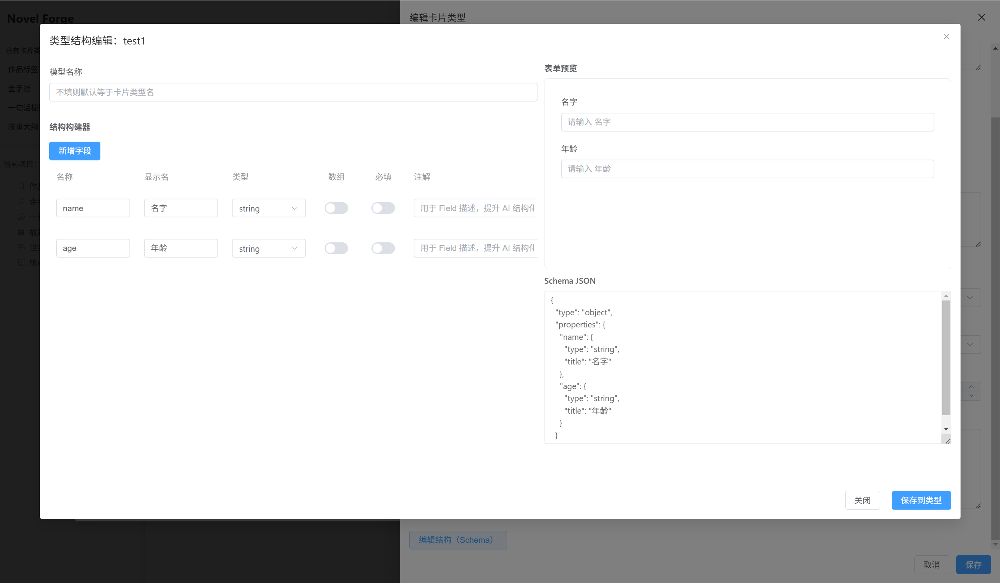
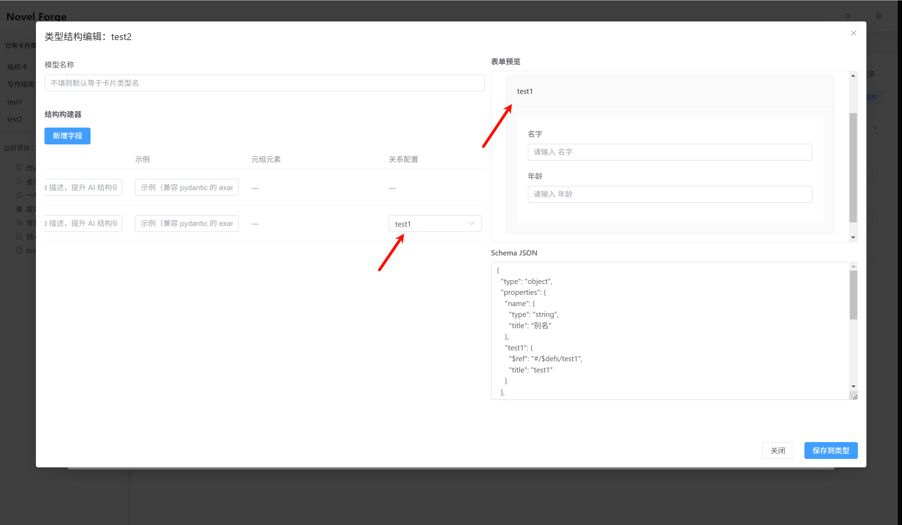

<div align="center">

# NovelForge

<p><strong>新一代 AI 长篇小说创作引擎</strong></p>

<p>
  <a href="#核心特性">核心特性</a> •
  <a href="#更新日志">更新日志</a> •
  <a href="#技术栈">技术栈</a> •
  <a href="#运行指南">运行指南</a> •
  <a href="#展望">展望</a>
</p>


</div>

**NovelForge** 是一款具备数百万字级长篇创作潜力的 AI 辅助写作工具。它不仅是编辑器，更是一套集世界观构建、结构化内容生成于一体的解决方案。

长篇创作中，维持一致性、保证可控性、激发持续灵感是最大的挑战。为此，NovelForge 围绕四大核心理念构建：模块化的 **“卡片”**、可自定义的 **“动态输出模型”**、灵活的 **“上下文注入”** 与保证一致性的 **“知识图谱”**。

---

<a id="核心特性"></a>
## ✨ 核心特性

*   **📚 动态输出模型 (Dynamic Output Models)**
    *   **告别传统手写 JSON 约束！** 基于 Pydantic 构建，你可以通过可视化界面自由定义任何创作元素（角色、场景、大纲）的结构。AI 的每一次生成都将被强制校验，确保输出是你想要的精确格式，这是实现高度结构化与可配置性的基石。

*   **✨ 自由上下文注入 (@DSL)**
    *   通过简单的 `@` 语法，你可以将项目中的任何卡片、任何字段、任何集合，按需注入到提示词中。无论是“当前角色的所有仇人”、“上一卷的所有场景”，还是“所有等级大于5的宝物”，复杂的上下文检索都只是一行表达式的事，为实现复杂创作逻辑提供了无限可能。

*   **🧠 知识图谱驱动 (Knowledge Graph)**
    *   为解决长篇创作中最棘手的一致性问题（如角色关系、称呼、立场变化），NovelForge 集成了 Neo4j。在创作过程中，系统能自动或手动提取文本中的人物关系与动态信息。在生成后续内容时，这些结构化的“事实”将被动态注入，显著减少 AI 幻觉，确保角色行为符合其人设与过往经历。

*   **🔮 灵感助手 (Inspiration Assistant)**
    *  灵感助手让创作过程变得更加自然和高效。你可以像和搭档交流一样，随时与助手对话，针对卡片的任意细节进行讨论和修改，无需每次都整体生成内容。支持跨项目引用，能把其他项目的卡片内容直接带入对话，方便对比、借鉴和碰撞新想法。觉得对话成果合适时，只需一键即可将其应用到卡片，整个过程直观顺畅。

*   **💡 灵感工作台 (Ideas Workbench)**
    *   灵感工作台是专为头脑风暴和创意整理设计的独立空间。在这里，你可以随手记录各种想法，创建不受项目限制的“自由卡片”。支持跨项目引用，能同时调取多个项目的卡片内容，帮助你打破边界，组合出全新的创意。当某个灵感成型后，可以一键将其移动或复制到正式项目中，让创意顺利落地。

*   **❄️ 雪花式创作流程 (Snowflake Method Inspired)**
    *   该项目借鉴了经典的“雪花创作法”，引导你从“一句话梗概”开始，逐步扩展到大纲、世界观、蓝图、分卷、章节，最终到正文。所有这些步骤都以独立的“卡片”形式存在，并以树形结构组织，让你的整个创作世界一目了然。

*   **🛠️ 高度可配置与可扩展**
    *   从 AI 模型参数、提示词模板，到卡片类型、内容结构，项目中几乎每一个环节都允许用户深度自定义，你可以打造一套完全属于自己的创作工作流。

---

<a id="更新日志"></a>

## 📅 更新日志

<details>
<summary>v0.8.5</summary>

- 使用新的agent框架进行了全面替换；优化灵感助手功能、UI
- 重新实现了React模式来为模型实现文本格式工具调用，适用工具调用能力不强的模型。可在设置-灵感助手处开启（默认关闭）
- 兼容了推理模型，增加了thinking模式
- 建议将DeepSeek、Qwen之类的模型选择/修改提供商为OpenAI兼容，而OpenAI则仅设置为GPT 5等官方模型。
- 其它若干优化

- 代码优化与修复bug
</details>

<details>
<summary>v0.8.3</summary>

- 灵感助手功能增强
  - 新增 ReAct 模式：兼容更多 LLM 模型（文本格式工具调用），可在设置中切换标准/ReAct 模式  
    (注意：由于时间关系，ReAct 模式实现较为粗糙，可能存在些bug，还是建议优先使用原生工具调用支持比较好的模型)
  - 上下文智能增强：工具返回值增加父卡片信息，AI 可更准确理解卡片层级关系

- UI 与体验优化
  - 引用卡片区域重构：固定布局、始终可见的 `...(N)` 按钮，使用 Popover 替代 Modal
  - 优化工具调用结果展示：显示成功/失败状态、支持跳转卡片、可折叠查看完整 JSON
  - 修复引用卡片与模型选择重叠问题，调整输入框高度

- 代码优化与修复bug

</details>

<details>

<summary>v0.8.2</summary>

- 优化灵感助手工具调用，增加自动重试功能。可通过.env文件配置最大重试次数
- 增强卡片拖拽功能，可自由排序
- 优化灵感助手UI、支持markdown显示
- 修复bug、清理代码

</details>

<details>

<summary>v0.8.0</summary>

- 章节编辑器重构
  - 从独立窗口迁移到主编辑器中栏，统一编辑体验
  - 新增右键快速编辑：选中文本后右键，可输入要求进行润色/扩写
  - 优化上下文组装：润色/扩写时自动包含上下文，衔接更自然
  - 动态高亮显示 AI 生成内容

- 灵感助手增强
  - 新增工具调用能力（实验性）：可直接在对话中创建/修改卡片，支持搜索、查看类型结构等操作
  - 历史对话管理：按项目存储对话历史，支持新增/加载/删除会话
  - 实时工具调用反馈：显示"正在调用工具..."，完成后自动刷新卡片树
  - 优化上下文构建：自动注入项目结构树、统计信息、操作历史

- 工作流系统优化
  - 节点自动注册机制：新增节点只需一行装饰器，前端自动同步
  - 动态节点库：从后端动态加载节点列表，零配置扩展

- UI 与体验优化
  - 修复暗黑模式下多处显示问题
  - 优化卡片编辑器布局与交互细节
  - 改进流式输出的视觉反馈

注意：如果之前选择本地开发，则当前版本更新需重新安装一下后端requirements

</details>

<details>

<summary>v0.7.8</summary>

- 工作流系统（实验性）继续推进
  - 新增“项目创建时触发（onprojectcreate）”，用工作流替代旧项目模板
  - 画布交互优化：拖拽创建节点、删除连接线、坐标定位更准确
  - 工作流工作室与节点参数面板的若干易用性优化
  - 注：工作流仍处于实验阶段，当前主要用于逐步替换原有硬编码逻辑，扩展新能力仍有较大提升空间

- 优化代码
  - 清理旧项目模板相关代码与界面，统一到工作流体系

</details>

<details>

<summary>v0.7.7</summary>

- 优化作品标签卡片
  - 增加标签项、选项数据
  - 将标签项类别数据抽离出来，设置为知识库文件存储，可在设置-知识库中编辑作品标签，自由的修改标签项类别
- 增加卡片AI生成时中断功能  
- 优化代码、修复bug，可通过.env配置是否在启动时重置知识库、提示词等内容

</details>

<details>

<summary>v0.7.6</summary>

- 增强LLM 管理
  - LLM 配置支持“测试连接”。
  - 支持用量设置：可设定 Token 上限、调用次数上限（-1 表示不限）。
  - 列表展示“已用（输入/输出/调用）”，并提供“一键重置统计”。（目前统计的token用量是粗略统计，不同模型计算方式可能不同，仅供参考）
  
- 优化代码、体验

</details>

<details>
<summary>v0.7.5</summary>

- 优化：灵感助手
  - 支持自由引用多个卡片数据（跨项目、去重与来源标记）。
  - 可在对话中选择 LLM 模型（可覆盖卡片配置）。
  - 对话历史按项目保存与恢复，重载不丢失。
  - 若干 UI 与交互细节优化。

- 初步：工作流（实验性）
  - 新增“工作流工作室”：画布（Vue Flow）、参数侧栏、节点库与触发器基础 CRUD。
  - 运行与事件：支持 SSE，`run_completed` 携带 `affected_card_ids`，前端按卡片粒度精确刷新。
  - 重要说明：当前为实验性功能，UI交互/DSL/校验/Runner/触发器等功能仍在完善。

</details>

<details>
<summary>v0.7.0</summary>

- 新增：灵感助手（Inspiration Assistant）
  - 右侧面板中的对话式协作工具，支持实时讨论和迭代优化卡片内容。
  - 跨项目卡片引用功能，可将任意项目的卡片数据注入对话，激发创意碰撞。
  - 自动引用当前选中卡片，实现无缝上下文切换。
  - 一键“定稿生成”，将对话成果直接应用到卡片内容。
  - 重置对话功能，便于开启新的创意讨论。

- 新增：灵感工作台（Ideas Workbench）
  - 独立窗口模式，提供专注的创意探索环境。
  - 自由卡片系统，不受项目结构约束。
  - 跨项目引用与创意融合能力。
  - 一键将自由卡片移动/复制到正式项目。

- 优化：导入卡片功能
  - 将“导入自由卡”升级为“导入卡片”，支持从任意项目导入。
  - 改进卡片选择器，按类型分组并支持折叠/展开。
  - 优化引用数据缓存，提升性能与响应速度。

</details>

<details>
<summary>v0.6.5</summary>

- 新增：项目模板（Project Templates）- 已在 v0.7.8 中迁移至工作流系统
  - 设置页新增"项目模板"管理，支持配置新建项目时自动创建的卡片类型与顺序，形成可复用的创作管线；可维护多个模板。
  - 新建项目支持选择模板。
  - 后端新增模板数据模型与 CRUD 接口，应用启动自动写默认项目模板。

</details>

---  

<a id="技术栈"></a>
## 🛠️ 技术栈

*   **前端 (Frontend):** Electron, Vue 3, TypeScript, Pinia, Element Plus
*   **后端 (Backend):** FastAPI, SQLModel (Pydantic + SQLAlchemy), Uvicorn
*   **数据库 (Database):** SQLite (核心数据), Neo4j (知识图谱)

---

<a id="运行指南"></a>
## 🚀 运行指南

无论你是想直接体验，还是参与开发，都可以轻松开始。

### 0. 核心依赖：Neo4j Desktop

**这是运行知识图谱功能的必要前提。**

*   请下载并安装 **Neo4j Desktop**，推荐版本 **5.16** 或更高。
*   下载地址: [Neo4j Desktop](https://neo4j.com/download/)
*   安装后，创建一个本地数据库实例，并确保其处于**运行状态**。默认连接信息可在 `.env` 文件中配置。


### 方式一：从源码运行 (开发者/最新功能)

**1. 后端 (Python / FastAPI)**
```bash
# 克隆仓库
git clone https://github.com/RhythmicWave/NovelForge.git
cd NovelForge/backend

conda create -n NovelForge python=3.11
conda activate NovelForge

# 安装依赖
pip install -r requirements.txt

将backend/.env.example文件修改为.env

# 运行后端服务
python main.py
```

**2. 前端 (Node.js / Electron)**
```bash
# 进入前端目录
cd ../frontend

# 安装依赖
npm install

# 启动开发服务器
npm run dev
```

#### 重要：.env 的 BOOTSTRAP_OVERWRITE

> 启动后端时，系统会按需初始化/更新内置资源（知识库、提示词、工作流等）。是否覆盖更新由 `.env` 中的 `BOOTSTRAP_OVERWRITE` 控制。

- 建议设置：
  - 如果你没有直接修改过内置资源，建议设置为：
    ```ini
    BOOTSTRAP_OVERWRITE=true
    ```
    这样可以在升级版本或重启时自动同步最新的内置知识库/提示词/工作流。
  - 如果你曾直接修改过“内置”资源，建议设置为 `false`，以避免被覆盖。

- 建议（避免被覆盖）：
  - 不要直接编辑“内置”资源。
  - 如需定制，请新建一个副本（复制知识库/提示词/工作流后重命名），在副本上修改。这样即使将来设置 `BOOTSTRAP_OVERWRITE=true`，你的自定义副本也不会被更新逻辑覆盖。


### 方式二：使用发行版 (快速上手)

不定期打包发布版本，无需配置开发环境，开箱即用。

1.  前往项目的 **Releases** 页面下载最新的便携版压缩包 (`.zip` 或 `.7z`)。
2.  解压到任意位置。
3.  **（重要）** 运行前，请先确保 Neo4j Desktop 中的数据库实例已启动。
4.  进入解压后的文件夹，找到 `backend` 目录，按需编辑 `.env` 文件以配置数据库连接。
5.  运行 `backend/NovelForgeBackend.exe` 启动后端服务。
6.  返回上一级，运行 `NovelForge.exe` 启动主程序。

> 大部分数据都存储在backend/aiauthor.db数据库中，当版本更新/迁移时，将该数据库文件复制到对应位置即可。
---

## ✍️ 创作流程

1.  **配置大语言模型 (LLM)**
    *   首次启动后，在设置中添加你的 AI 模型配置，如 API Key、Base URL 等。
    
    推荐使用Gemini 2.5Pro级别的LLM进行创作

2.  **创建项目与初始化工作流**
    *   新建项目时，可以选择一个初始化工作流（通常是 `onprojectcreate` 类型）来自动创建预设卡片。系统内置了"项目创建·雪花创作法"工作流，会按照雪花创作法自动创建一套完整的卡片树。
    

3.  **自顶向下，填充核心设定**
    *   从最高层的卡片开始，利用 AI 逐一填充内容。例如，基于"一句话梗概"生成"故事大纲"，再生成"世界观"和"核心蓝图"。
    基本上每个步骤都提供了AI生成的选项。
    完成核心蓝图卡片创作后，点击保存，会自动根据分卷数量创建对应分卷卡片。
    继续完成分卷大纲创作即可，从第1卷开始。
    完成之后，会自动根据阶段数创建阶段大纲子卡片、写作指南卡片。建议先生成写作指南卡片，生成写作指导信息，再进行阶段大纲卡片创作。
    

4.  **借助灵感助手完善内容**
    *   在写作过程中，如果你想进一步打磨或优化卡片内容，可以随时使用右侧的灵感助手。
    *   选中任意卡片后，灵感助手会自动读取该卡片的内容，方便你参考和思考。
    *   你可以直接向助手提出具体问题，比如“这个角色的动机是否合理？”、“怎样让这个场景更有张力？”等。
    *   灵感助手会结合当前卡片内容，给出针对性的建议，你可以与助手反复交流，逐步完善想法。
    *   通过“添加引用”按钮，还能把当前项目或其他项目的相关卡片内容加入对话，激发更多创意火花。
    *   灵感助手具备感知上下文、调用工具修改/创建卡片内容的能力（实验性）
    

5.  **完成阶段大纲创作后，自动生成章节大纲、章节正文卡片，并自动注入每章需要参与的实体。**
    

6.  **进入章节创作**
    *   完成上述步骤后，点击对应的章节正文卡片，打开章节编辑器，进入核心的写作界面。右侧的上下文面板会自动为你准备好当前章节所需的全部背景资料。
    
    
    *    可点击续写进行AI生成（如果没有任何内容，则自动从头开始写）。
    *    若对生成内容不满意，可选中内容点击右键进行快速编辑，然后输入要求，点击润色/扩写，可以重写这部分内容。
    

    *   内容创作完成后，点击入图关系，解析出角色之间的关系存入知识图谱，供后续写作时参考。
    
    提取完成后，点击确认即可存入neo4j数据库。
    

    *    建议再提取角色动态信息，可用成本更低的模型进行提取。
  

    *    以上步骤完成后，进行下一章创作时，自动注入相关参与实体的信息
    

7.  **灵感工作台：捕捉创意火花**
    *   有了新点子却一时不知道归属哪个项目？点击页面顶部的“灵感”按钮，即可打开独立的灵感工作台窗口。
    *   在这里，你可以随手记录各种想法，自由创建不同类型的卡片，无需考虑项目结构，专注于把灵感落到实处。
    *   右侧的灵感助手支持引用任意项目的卡片内容，方便你跨项目查阅、对比和组合，激发更多创意。
    *   当某个想法逐渐成型，只需用顶部的“移动/复制到项目”功能，就能把自由卡片一键归入正式项目，创意自然衔接到后续创作中。
    
    
---

## ⚙️ 高级功能与配置

虽然 NovelForge 提供了一套推荐的创作流程，但其真正的强大之处在于高度的灵活性。你可以完全抛开预设，利用以下工具，组合出专属于你自己的创作体系。

### Schema-first：类型/实例结构与参数

*   在 `设置 -> 卡片类型` 中，使用结构构建器为类型定义 `json_schema`（支持基础类型、relation(embed)、tuple 等）。类型 Schema 将作为该类型卡片的默认结构。
    
    

*   在具体卡片中，可打开 `结构`（Schema Studio）对该卡片实例的结构进行覆写，或一键"应用到类型"。
    

    

    应用到类型之后，后续再创建该类型卡片将使用新的结构。

*   卡片 AI 参数：通过编辑器工具栏的"模型"按钮打开参数弹层，设置 `llm_config_id`、`prompt_name`、`temperature`、`max_tokens`、`timeout`。。
    

*  完成以上设置后，即可在项目中创建该类型的卡片并进行 AI 生成。前端会将该卡片的"有效 Schema"一并发送给后端进行结构化校验与输出。
    
    新建卡片时也可以直接从已有卡片中拖动到下方，自动创建
    

    

*  Schema 支持嵌入（`$ref` 到类型 `$defs`），可以组合复用已有结构，便于复合能力搭建。

    
    
注意，尽量新增模型而不是修改已存在模型结构，避免和已有数据冲突。


### 提示词工坊 (Prompt Workshop)

*   所有 AI 功能的背后都是可编辑的提示词模板。你可以在这里修改预设模板，或创建全新的模板。
*   **知识库注入**: 支持通过 `@KB{name=知识库名称}` 语法，在提示词中动态引用"知识库"内容，为 AI 提供更丰富的背景信息。

### 上下文注入 (@DSL) 详解

这是 NovelForge 的特色。它允许你在提示词模板中，用 `@` 符号精确地引用项目中的任何数据注入为上下文。

*   **按标题引用**: `@卡片标题` 或 `@卡片标题.content.某个字段`
*   **按类型引用**: `@type:角色卡` (所有角色卡)
*   **特殊引用**: `@self` (当前卡片), `@parent` (父卡片)
*   **强大的过滤器**:
    *   `[previous]`: 获取同级的前一个卡片。
    *   `[previous:global:n]`: 获取全局顺序（树状先序）中最近的n个同类型卡片。
    *   `[sibling]`: 获取所有同级兄弟卡片。
    *   `[index=...]`: 按序号获取，支持表达式，如 `$self.content.volume_number - 1`。
    *   `[filter:...]`: 按条件过滤，如 `[filter:content.level > 5]` 或 `[filter:content.name in $self.content.entity_list]`。
*   **字段级别选中**: 可选中整个卡片数据，也可以单独选中卡片的字段。

例如，引用最近3章的章节标题及原文:


### 工作流系统（实验性）

> 注意：工作流系统目前仍为实验性功能。现阶段的目标是“逐步替换原有的硬编码流程”（如保存时自动创建子卡、项目初始化等），以获得更好的可视化与可编排性；在“扩展全新能力、通用化节点生态、复杂条件/并行”等方面仍有不小的提升空间，后续版本会持续完善。

工作流系统允许你将创作流程编排成可视化、可复用的流程，并在合适的时机自动执行。

#### 工作流工作室

- 访问"工作流"页面，进入可视化的工作流编辑器
- 使用拖拽方式从底部节点库创建节点，通过连线定义执行顺序
- 支持的节点类型：
  - `Card.Read`: 读取卡片内容到工作流上下文
  - `Card.UpsertChildByTitle`: 创建或更新子卡片
  - `Card.ModifyContent`: 修改卡片内容
  - `List.ForEach`: 遍历数组执行子流程
  - `List.ForEachRange`: 按数字范围循环执行
- 智能参数面板会根据节点类型自动显示可配置参数，支持字段路径选择和实时验证


#### 触发器配置

每个工作流可以配置一个或多个触发器，定义何时自动执行：

- **保存时触发 (onsave)**: 当指定类型的卡片保存时自动执行
- **生成完成时触发 (ongenfinish)**: AI 生成完成后自动执行
- **手动触发 (manual)**: 通过右键菜单手动执行
- **创建项目时触发 (onprojectcreate)**: 新建项目时自动执行，用于项目初始化


#### 内置工作流模板

系统预置了多个常用工作流，可直接使用或作为参考：

- **项目创建·雪花创作法**: 新建项目时按照雪花创作法自动创建初始卡片结构
- **世界观·转组织**: 从世界观设定的势力列表自动生成组织卡
- **核心蓝图·落子卡**: 根据蓝图内容自动创建角色卡、场景卡和分卷卡片
- **分卷大纲·落子卡**: 根据分卷大纲自动创建阶段大纲和写作指南
- **阶段大纲·落章节卡**: 根据阶段大纲的章节列表自动创建章节大纲和正文卡片

#### 项目初始化工作流

新建项目时，可以选择一个 `onprojectcreate` 触发器的工作流作为项目模板：

- 默认选择"项目创建·雪花创作法"，自动创建作品标签、金手指、一句话梗概、故事大纲、世界观设定、核心蓝图等卡片
- 也可以在工作流工作室中创建自己的项目初始化工作流，完全自定义项目起始结构
- 支持复杂的初始化逻辑，如根据条件创建不同的卡片结构


---

## 许可证协议
本项目采用双许可证授权模式：

- 默认情况下，本项目基于 GNU Affero General Public License v3.0 (AGPLv3) 授权协议
- 提供服务型商用：将本项目（或其修改版本）作为后端以 SaaS、托管或其他形式向第三方提供服务，须通过作者获取商业授权许可。

请遵守开源协议条款，并在适用场景下取得相应授权。

---

## 📂 项目结构

```
NovelForge/
  ├── backend/        # FastAPI 后端
  │   ├── app/
  │   │   ├── api/        # API 路由
  │   │   ├── db/         # 数据库模型与会话
  │   │   ├── schemas/    # Pydantic 数据模型
  │   │   └── services/   # 核心业务逻辑
  │   └── main.py       # 入口
  │
  └── frontend/       # Electron + Vue3 前端
      └── src/
          ├── main/       # Electron 主进程
          ├── preload/    # 预加载脚本
          └── renderer/   # Vue 渲染进程
              └── src/
                  ├── components/ # Vue 组件
                  ├── services/   # 前端服务
                  ├── stores/     # Pinia 状态管理
                  └── views/      # 页面视图
```

---

<a id="展望"></a>
## 展望

NovelForge 目前仍处于迭代的早期阶段，作者深知该项目在创作流程、一致性维持、 UI 设计、交互体验等方面还有巨大的改进空间。

最好的工具源于社区的智慧。无论你是创作者还是开发者，都真诚地欢迎你：

*   在 **Issues** 中提出宝贵的功能建议或反馈问题。
*   分享你对创作流程的独到见解。


## TODO

- [ ] **增强知识图谱注入**: 实现更智能、更自动化的关系与事实注入机制，进一步降低 AI 幻觉。
- [ ] **优化创作流程**: 提供更灵活、更强大的流程编排与引导功能，适应不同的创作风格。
- [ ] **提升交互体验**: 持续打磨 UI/UX，使其更直观、更高效，减少不必要的操作。


