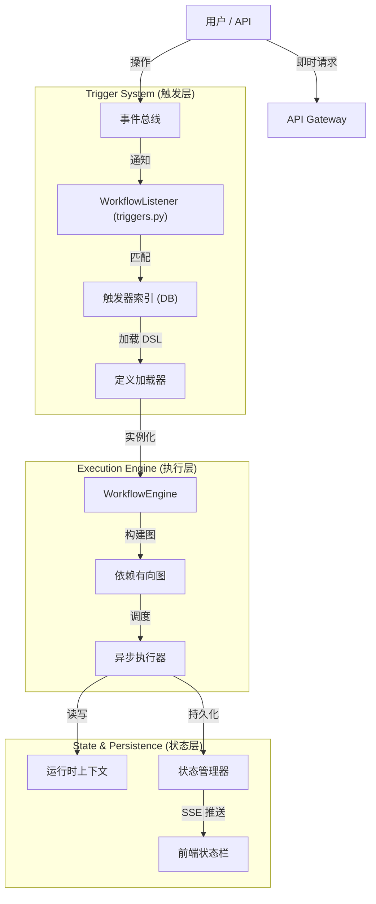

# NovelForge 工作流系统开发文档


---

## 1. 系统概述

NovelForge 工作流系统是一个专为小说创作设计的自动化编排引擎。它采用 **类 ComfyUI 的节点化 (Node-based)** 设计，结合 **事件驱动 (Event-Driven)** 架构，允许用户通过可视化拖拽的方式，定义从简单的自动化任务（如"自动生成摘要"）到复杂的创作辅助流程（如"世界观一致性检查"）。

系统的核心设计哲学是 **配置即代码 (Configuration as Code)** 与 **数据驱动 (Data-Driven)**。用户在前端的所有操作最终都转化为标准的 DSL (Domain Specific Language) 存储，由强大的 Python 后端引擎负责解析与执行。

---

## 2. 核心架构

系统采用分层架构设计，确保了高内聚低耦合。



### 2.1 关键组件说明

*   **WorkflowEngine**: 核心引擎。负责解析 JSON DSL，构建 `ExecutionGraph` (DAG)，进行环路检测和拓扑排序。如果发现循环依赖，构建阶段即会报错。
*   **WorkflowExecutor**: 执行器。负责具体的节点调度。它维护一个 `ready_queue`，支持节点的异步并发执行 (AsyncIO)。
*   **WorkflowListener**: 系统的"感官"。它监听全站的业务事件（如 `card_updated`, `project_created`），并在毫秒级内匹配出需要运行的工作流。
*   **StateManager**: 负责 `WorkflowRun` 的生命周期管理、日志记录、以及输入输出数据的持久化。
*   **Node Registry**: 动态插件系统。所有的节点（包括触发器）都通过装饰器动态注册，系统启动时自动发现。

---

## 3. 运行机制与生命周期

### 3.1 状态流转 (State Transition)

工作流的执行是一个严格的状态机转换过程。

**运行级状态 (RunStatus):**
*   `queued`: 已创建运行记录，等待调度。
*   `running`: 正在执行。至少有一个节点处于运行状态。
*   `succeeded`: 所有可达节点均执行成功。
*   `failed`: 发生未捕获的错误。
*   `cancelled`: 用户手动取消。
*   `timeout`: 超过最大执行时长（默认无限制）。

**节点级状态 (NodeStatus):**
*   `idle`: 初始状态。
*   `pending`: 依赖已满足，进入就绪队列。
*   `running`: 正在执行业务逻辑。
*   `success`: 执行成功。
*   `error`: 执行失败。
*   `skipped`: 因前置分支未被激活或逻辑判断被跳过。

### 3.2 持久化策略 (Persistence)

并非所有工作流都需要永久保存历史记录。系统支持两种持久化模式，通过工作流设置中的 `keep_run_history` 字段控制：

1.  **持久化运行 (False)**: 
    *   主要用于后台自动化任务（如"自动备份"）。
    *   **策略**: 数据库保留完整的 `WorkflowRun` 记录，包含所有节点的输入输出快照。
    *   **用途**: 用于审计、调试回放。

2.  **临时运行 (Transient)**: 
    *   主要用于一次性辅助生成（如"UI上点击生成名字"）。
    *   **策略**: 数据库仍会创建记录以支持状态栏显示，但会标记为临时。
    *   **用途**: 系统定期清理任务会扫描并删除这些数据，防止数据库膨胀。

---

## 4. 触发器系统详解

本系统采用先进的 **"触发器即节点" (Trigger-as-a-Node)** 设计模式。触发器不是依附于工作流的外部属性，而是工作流图中的**起始节点**。

### 4.1 动态注册协议
系统如何知道"当卡片保存时"要运行哪些工作流？我们摒弃了硬编码，采用了动态协议：

任何节点类都可以通过实现 `extract_trigger_info` 协议变身为触发器：

```python
@classmethod
def extract_trigger_info(cls, config):
    # 告诉系统：我对 "onsave" 事件感兴趣，过滤条件是 config
    return "onsave", config
```

当工作流被保存时，后台会自动扫描图中所有节点，调用此协议构建索引。

### 4.2 多触发器与多态入口
**一个工作流可以拥有多个触发器节点**。这为系统提供了极大的灵活性：

*   **混合触发**: 一个"文本优化"工作流，既可以由 `Trigger.CardSaved` 自动触发，也可以由 `Trigger.Manual` 供用户手动点击触发。
*   **并行入口**: 运行时，所有无依赖的起始节点（Roots）都会并发启动。哪个触发器被激活，其携带的数据就会注入到上下文中。

### 4.3 内置触发器参考

| 节点类型 | 描述 | 核心配置项 | 注入变量 (可通过 {var} 引用) |
| :--- | :--- | :--- | :--- |
| **Trigger.CardSaved** | 卡片内容保存时 | `card_type` (过滤类型)<br>`filter_config` (支持值比较/字段变更检测) | `card_id`, `project_id`, `card_title`, `trigger_event` |
| **Trigger.ProjectCreated**| 新项目创建时 | 无 | `project_id`, `project_name`, `user_id` |
| **Trigger.Manual** | 用户手动运行 | `parameters` (定义表单 Schema) | `params` (用户填写的表单数据), `user_id` |

---

## 5. 数据流与控制流

系统支持极其灵活的混合流编排，满足复杂业务需求。

### 5.1 显式数据流 (Pipeline)
*   **可视化**: 画布上的 **实线**，连接节点的 **左右端口** (Handles)。
*   **机制**: 严格的数据管道。上游节点的 Output 直接传递给下游节点的 Input。
*   **特点**: 清晰、可视、强类型约束。

### 5.2 隐式数据流 (Context)
*   **可视化**: 无连线，通过模板语法引用。
*   **机制**: 类似于编程中的"全局变量"。
*   **来源**: 
    1. **环境注入**: 触发器将 `project_id` 等环境信息写入全局 Context。
    2. **节点写入**: 任何节点都可以向 Context 写入副作用数据。
*   **用法**: 在任意输入框中输入 `{card.title}` 即可自动引用。

### 5.3 控制流 (Dependency)
*   **可视化**: 画布上的 **虚线**，连接节点的 **上下端口**。
*   **机制**: 仅定义执行顺序，不传递数据。
*   **场景**: "必须先创建文件夹，再写入文件"。即使两者没有数据交换，也必须保证先后顺序。

---

## 6. 前端可视化系统

前端基于 **Vue Flow** 构建，提供了 ComfyUI 风格的专业编辑体验。

### 6.1 Schema 驱动的属性面板
为了解决"后端改逻辑，前端跑断腿"的问题，我们实现了 **Schema-Driven UI**。

后端 Pydantic 模型直接定义 UI：
```python
# 后端定义
class AIConfig(BaseNodeConfig):
    mode: Literal["Precise", "Creative"] = "Creative"  # -> 渲染为下拉单选
    api_keys: List[str] = []                            # -> 渲染为动态增删列表
    enable_web: bool = False                            # -> 渲染为开关
```
前端通用组件 `PropertyPanel` 会自动解析 JSON Schema 并渲染出对应的 Element Plus 组件。

### 6.2 全局状态栏
位于界面左下角的 **Global Workflow Status Bar** 是系统的监控中心：
*   **实时 SSE**: 使用 Server-Sent Events 技术，毫秒级推送运行状态。
*   **视觉反馈**: 
    *   **Loading**: 旋转动画表示正在处理。
    *   **Flash**: 任务成功/失败时，状态栏会发出绿色/红色光晕闪烁，提供非侵入式的即时反馈。
*   **交互**: 支持任意拖拽，可折叠/展开查看详细历史。

---

## 7. 开发扩展指南

### 7.1 开发新功能节点
只需 3 步即可扩展系统能力：

1.  **定义配置 (Config)**: 继承 `BaseNodeConfig`，定义参数。
2.  **实现逻辑 (Execute)**: 继承 `BaseNode`，实现 `execute` 异步方法。
3.  **注册 (Register)**: 添加 `@register_node` 装饰器。

**代码示例**:
```python
@register_node
class SleepNode(BaseNode):
    node_type = "Utils.Sleep"
    label = "延时等待"
    config_model = SleepConfig # 定义了 seconds 字段

    async def execute(self, inputs, config):
        await asyncio.sleep(config.seconds)
        return ExecutionResult(success=True)
```

### 7.2 开发触发器节点
如果是触发器节点，除了常规步骤外，还需要额外实现 `extract_trigger_info` 协议，以便系统能将其注册到事件索引中。

```python
@register_node
class MyCronTrigger(BaseNode):
    node_type = "Trigger.Cron"
    # ... 配置定义 ...
    
    @classmethod
    def extract_trigger_info(cls, config):
        """
        返回元组 (索引键, 过滤配置)
        - 索引键: 对应 workflow_triggers 表的 trigger_on 字段
        - 过滤配置: 存入 filter_json
        """
        # 告诉系统：我是 cron 类型，把 cron 表达式存入数据库
        return "__cron__", {"expression": config.get("cron_expression")}
```

### 7.3 调试与排错
*   **日志**: 每个节点执行都会产生详细的结构化日志，存储在 `NodeExecutionState.logs_json` 中。
*   **回放**: 前端支持查看历史运行记录，点击节点可查看当时的输入、输出和报错信息。

---

## 8. 最新功能特性 (New Features - V3.1)

### 8.1 拆书/逆向工程工作流支持
系统新增了一组专用于处理长文本与结构化提取的节点，支持"Book Deconstruction"场景：

| 节点类型 | 描述 | 核心能力 |
| :--- | :--- | :--- |
| **Novel.Load** | 小说加载 | 扫描本地目录，自动提取分卷与章节元数据，修复了默认分卷与Index提取问题。 |
| **AI.BatchStructured** | 批量结构化 | 支持高并发(AsyncIO Semaphore)调用 LLM，集成 `step_progress` 实时进度上报，支持断点续传。 |
| **Data.Group** | 数据分组 | 将列表数据按指定字段(如 `volume`)分组，便于分层处理。 |
| **Logic.SelectProject** | 项目选择 | 工作流启动时选择目标项目，并将 ID 注入全局变量，解决无上下文启动问题。 |

### 8.2 增强的实时反馈 (SSE Step Progress)
状态管理层 (`StateManager`) 与 API 层已升级，支持 `step_progress` 事件。
*   **原机制**: 仅节点状态变化 (Running -> Success) 时推送。
*   **新机制**: 节点内部(如批量处理100章)可由 `update_node_status` 触发细粒度进度事件，前端进度条可实时显示 "45%"。

### 8.3 增强的基础设施
*   **Bootstrap Auto-Init**: 系统启动时自动扫描 `app/bootstrap/workflows` 和 `prompts` 目录，自动初始化/更新数据库中的内置工作流与提示词（受 `.env` 中 `BOOTSTRAP_OVERWRITE` 控制）。
*   **Prompt Management**: 新增 `Prompt.Load` 节点及配套的提示词文件加载机制，实现了提示词的规范化管理。
*   **Dynamic Parent ID**: `Card.BatchUpsert` 支持动态父卡片 ID 模板 (e.g., `{item.meta.volume_parent_id}`)，完美支持构建层级化数据。
